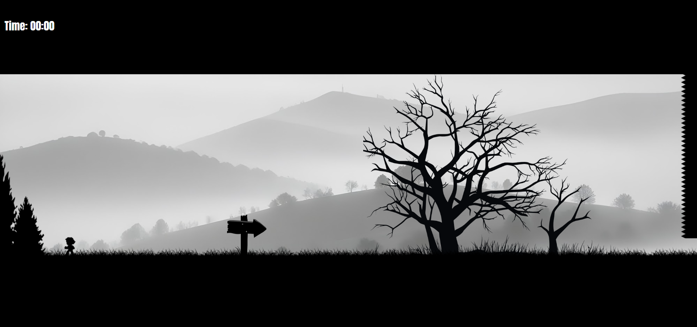
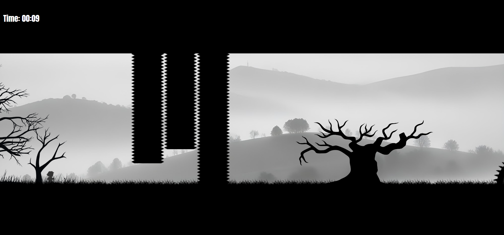

# **Shadow Runner**
---
## **Live Demo**

Play the game here: [Shadow Runner Game](https://shadow-game.vercel.app/)

## **Game Features**

- **Silhouette Theme**: Navigate through a shadowy world filled with silhouette-based obstacles and characters.
- **Responsive Controls**: Move left or right using the mouse scroll wheel or touch gestures. Jump using the arrow key or swipe up on touch devices.
- **Dynamic Obstacles**: Be prepared for obstacles that can transform, like bushes turning into dangerous monsters.
- **Timer & High Score**: A built-in timer tracks how long it takes to reach the finish line. Try to beat your best time and set a new high score!
- **Real-Time Collision Detection**: The game features precise collision detection to enhance the challenge of avoiding obstacles.
- **Game Over & Restart**: If a collision occurs with an obstacle, the game ends, and you can restart to try again!

--- 

## **How to Play**

1. **Move Left/Right**: 
   - Use the mouse scroll wheel (or two-finger scroll on trackpads) to move the hero. 
   - Swipe left or right on mobile devices to move.
2. **Jump**:
   - Press the **Up Arrow** key to jump on desktop or swipe up on mobile devices.
3. **Avoid Obstacles**: 
   - Dodge dynamic obstacles like bushes that transform into monsters.
4. **Win the Game**: 
   - Reach the finish line as quickly as possible to beat your best time.
   - If you touch an obstacle, the game ends, and you can restart.

## **Controls**

- **Scroll Wheel / Swipe**: Move left or right
- **Up Arrow / Swipe Up**: Jump
- **Mouse / Touch**: Interact with the environment

## **Screenshots**
&nbsp;

&nbsp;

&nbsp;

 ---
## **Future Enhancements**

- Add more levels with increasing difficulty.
- Introduce power-ups and additional animations.
- Enhance sound effects and background music.

